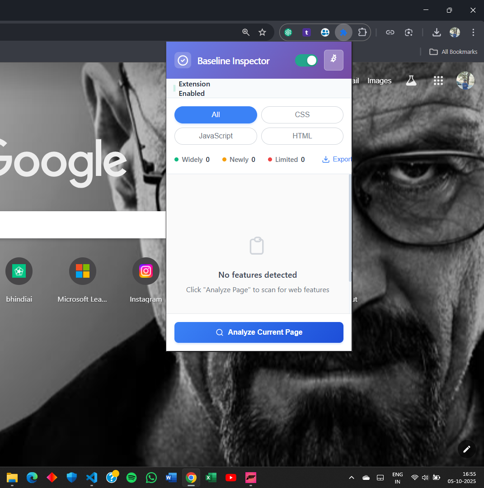
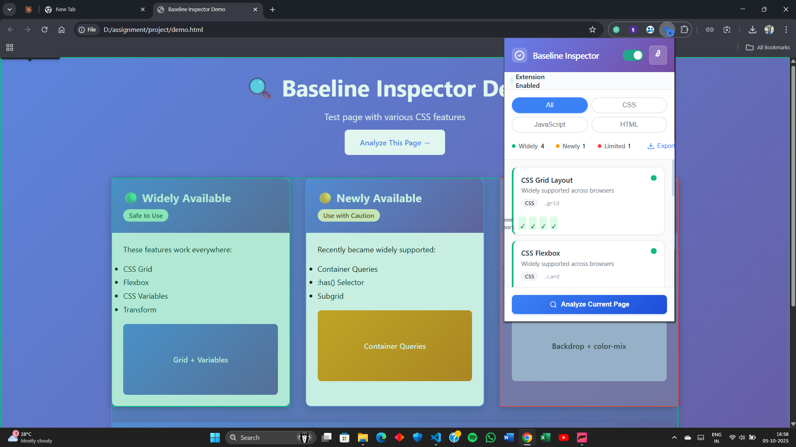
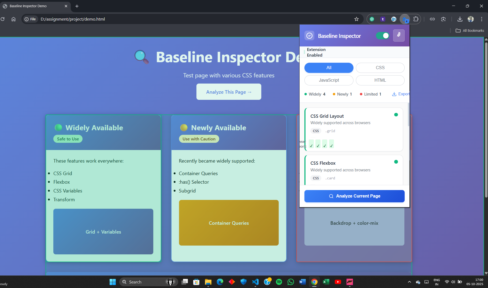

# 🔍 Baseline Inspector

> A powerful Chrome extension that analyzes web pages for browser compatibility using the Web Platform Baseline standard.


## 🎯 What is Baseline Inspector?

Baseline Inspector helps developers instantly identify which CSS features and web platform APIs are **Widely Available**, **Newly Available**, or have **Limited Support** across browsers. Stop guessing about browser compatibility—get instant insights while you develop!

## ✨ Features

- **🎨 Real-time CSS Analysis** - Scans stylesheets for Baseline feature usage
- **📊 Visual Dashboard** - Color-coded overlay showing compatibility status
- **📈 Statistics Panel** - Pie chart breakdown of feature support levels
- **💡 Smart Suggestions** - Get fallback recommendations for risky features
- **📤 Export Reports** - Generate HTML/Markdown compatibility reports
- **⚡ Zero Configuration** - Works instantly on any webpage

## 🚀 Installation

### Load as Unpacked Extension

1. **Download or Clone** this repository:

   ```bash
   git clone https://github.com/Oomszz/Baseline-Inspetor-Browser-Extension.git
   ```

2. **Open Chrome Extensions Page**:

   - Navigate to `chrome://extensions/`
   - Or click Menu → More Tools → Extensions

3. **Enable Developer Mode**:

   - Toggle the "Developer mode" switch in the top-right corner

4. **Load the Extension**:
   - Click "Load unpacked"
   - Select the `Baseline-Inspetor-Browser-Extension` folder
   - The extension icon should appear in your toolbar!

## 📖 Usage

### Quick Start (3 Steps)

1. **Click** the Baseline Inspector icon in your Chrome toolbar
2. **Analyze** - Click "Inspect Current Page" button
3. **View Results** - See the overlay with feature compatibility

### Detailed Workflow

#### Step 1: Open Any Webpage

Navigate to any website you want to analyze (try the included `demo.html` for testing).

#### Step 2: Launch Inspector

Click the extension icon and hit **"Inspect Current Page"**.

#### Step 3: Review the Overlay

- **🟢 Green Badges** = Widely Available (safe to use)
- **🟡 Yellow Badges** = Newly Available (use with caution)
- **🔴 Red Badges** = Limited Support (needs fallbacks)

#### Step 4: View Statistics

Check the popup for:

- Pie chart breakdown of feature distribution
- Total feature count
- Risk assessment

#### Step 5: Export Report

Click **"Export Report"** to download:

- HTML report with full details
- Markdown summary for documentation

## 📸 Screenshots

-popup.png


-overlay.png


### Extension Popup


_Clean, modern interface with instant analysis_

### Overlay on Demo Page


_Real-time feature detection with color-coded badges_


### Statistics Dashboard


_Visual breakdown of baseline compatibility_

## 🛠️ Technical Details

### Built With

- **Vanilla JavaScript** - No frameworks, pure performance
- **Chrome Extension Manifest V3** - Latest extension API
- **Tailwind CSS** - Modern, responsive UI
- **Chart.js** - Beautiful data visualization
- **Web Features API** - Official Baseline data

### Project Structure

```
baseline-inspector/
├── manifest.json          # Extension configuration
├── popup.html            # Extension popup UI
├── popup.js              # Popup logic
├── content.js            # Page analysis script
├── background.js         # Service worker
├── styles.css            # Custom styles
├── demo.html             # Test page
└── icons/                # Extension icons
```

## 🎨 Demo Page

Test the extension on the included `demo.html`:

```bash
# Open demo.html in Chrome
# Click extension icon
# See instant analysis!
```

The demo showcases:

- Grid layouts (Widely Available)
- CSS custom properties (Widely Available)
- Container queries (Newly Available)
- Backdrop filters (Limited Support)

## 🌟 Why Baseline Inspector?

### Problem It Solves

Developers waste hours debugging cross-browser issues. Baseline Inspector prevents these issues **before** they happen by:

- Identifying risky CSS features during development
- Providing instant compatibility feedback
- Suggesting safer alternatives

### Unique Differentiators

1. **Visual Overlay** - See compatibility inline, not in console
2. **Statistics Dashboard** - Quick risk assessment at a glance
3. **Smart Suggestions** - Get fallback recommendations
4. **Export Reports** - Share compatibility findings with team

## 🤝 Contributing

Contributions are welcome! This is an open-source hackathon project.

1. Fork the repository
2. Create your feature branch (`git checkout -b feature/AmazingFeature`)
3. Commit your changes (`git commit -m 'Add some AmazingFeature'`)
4. Push to the branch (`git push origin feature/AmazingFeature`)
5. Open a Pull Request

## 📄 License

This project is licensed under the MIT License - see the [LICENSE](LICENSE) file for details.

## 🙏 Acknowledgments

- **Web Platform DX Community** - For the Baseline standard
- **MDN Web Docs** - For feature compatibility data
- **Chrome Extensions Team** - For the robust platform

## 📬 Contact

**Created by**: Oomszz  
**Project Link**: [GitHub Repository](https://github.com/Oomszz/Baseline-Inspetor-Browser-Extension)

---

⭐ **Star this repo** if you find it useful!  
🐛 **Report issues** to help improve the extension  
💡 **Suggest features** for future versions

## 🗺️ Roadmap

- [ ] Firefox & Edge support
- [ ] JavaScript API detection
- [ ] Team collaboration features
- [ ] CI/CD integration
- [ ] Custom rule configuration

---

_Built with ❤️ for the web development community_
