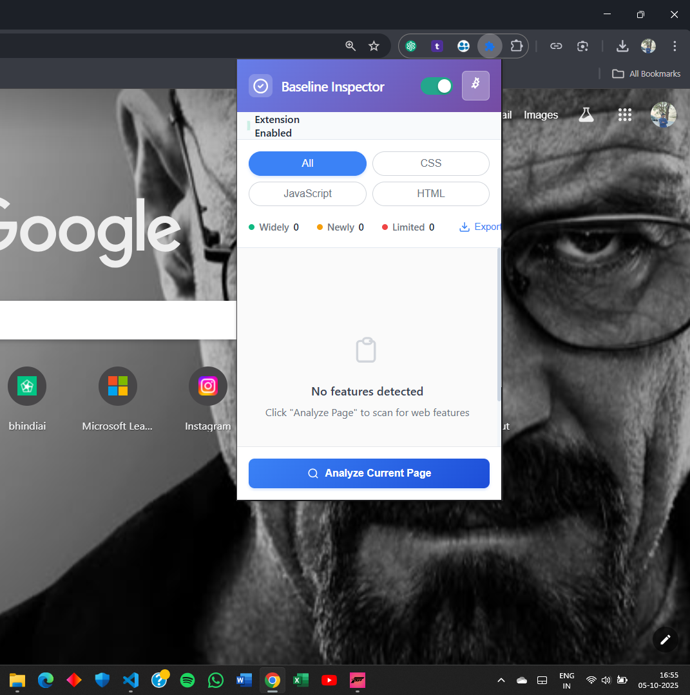
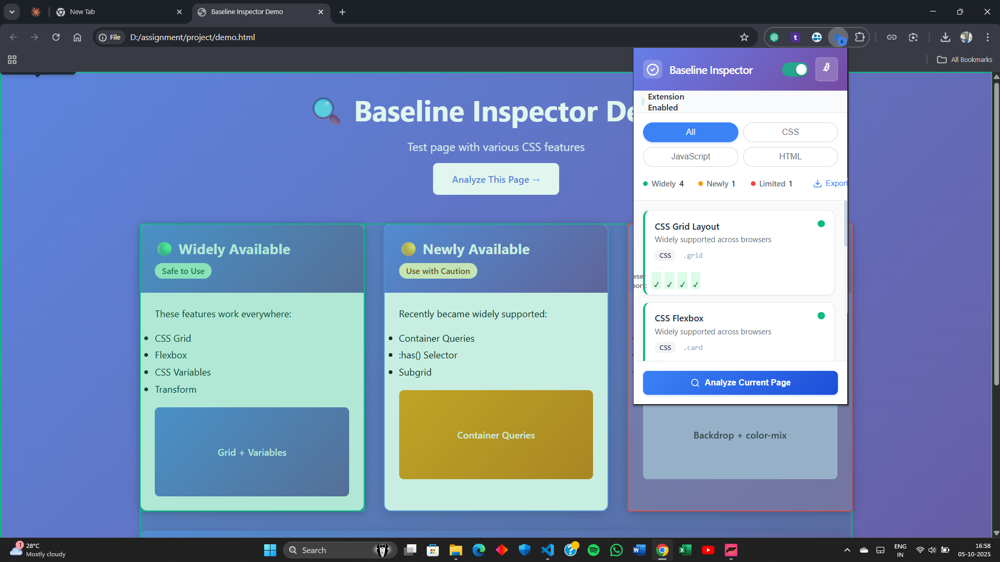
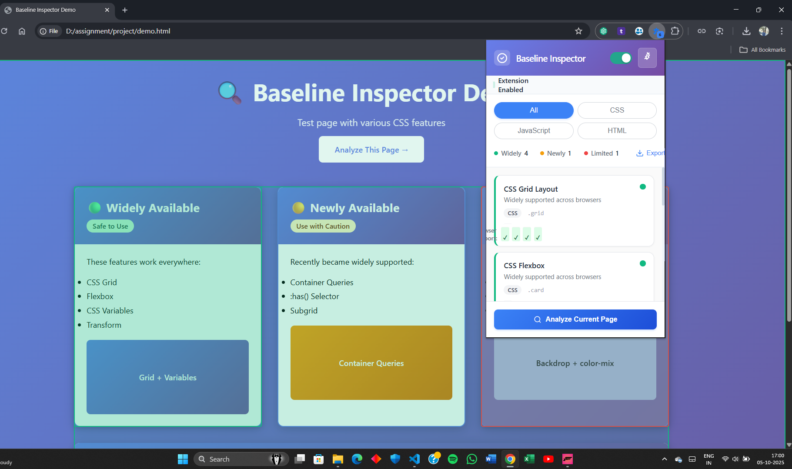

#🔍 Baseline Inspector

A powerful Chrome extension that analyzes web pages for browser compatibility using the Web Platform Baseline standard.

##🎯 What is Baseline Inspector?

Baseline Inspector helps developers instantly identify which CSS, HTML, and JavaScript features are Widely Available, Newly Available, or have Limited Support across browsers. Stop guessing about browser compatibility—get instant insights directly on the page!

##✨ Features

-🎨 Real-time CSS, HTML & JS Analysis - Scans stylesheets, inline styles, HTML elements, and JavaScript API usage

-📊 Visual Dashboard - Color-coded overlay showing compatibility status

-📈 Statistics Panel - Pie chart breakdown of feature support levels

-💡 Smart Suggestions - Get fallback recommendations for risky features

-📤 Export Reports - Generate HTML/Markdown compatibility reports

-⚡ Zero Configuration - Works instantly on any webpage

##🚀 Installation
Load as Unpacked Extension

-Download or Clone this repository:

git clone https://github.com/Oomszz/Baseline-Inspector-Browser-Extension.git

-Open Chrome Extensions Page:

Navigate to chrome://extensions/

Or click Menu → More Tools → Extensions

-Enable Developer Mode:

Toggle the "Developer mode" switch in the top-right corner

-Load the Extension:

Click "Load unpacked"

Select the Baseline-Inspector-Browser-Extension folder

-The extension icon should appear in your toolbar!

##📖 Usage
Quick Start (3 Steps)

-Click the Baseline Inspector icon in your Chrome toolbar

-Analyze - Click "Inspect Current Page" button

-View Results - See the overlay with feature compatibility

##Detailed Workflow

-Step 1: Open Any Webpage

Navigate to any website you want to analyze (try the included demo.html for testing).

-Step 2: Launch Inspector

Click the extension icon and hit "Inspect Current Page".

-Step 3: Review the Overlay

-🟢 Green Badges = Widely Available (safe to use)

-🟡 Yellow Badges = Newly Available (use with caution)

-🔴 Red Badges = Limited Support (needs fallbacks)

-Step 4: View Statistics

Check the popup for:

Pie chart breakdown of feature distribution

Total feature count

Risk assessment

-Step 5: Export Report

Click "Export Report" to download:

JSON/HTML report with full details

Markdown summary for documentation

##📸 Screenshots
--Extension Popup:- Clean, modern interface with instant analysis  

--Overlay on Demo Page :- Real-time CSS, HTML, and JS feature detection with color-coded badges 

--Statistics Dashboard :- Visual breakdown of baseline compatibility 

##🛠️ Technical Details
Built With

Vanilla JavaScript - No frameworks, pure performance

Chrome Extension Manifest V3 - Latest extension API

Tailwind CSS - Modern, responsive UI

Chart.js - Beautiful data visualization

Web Features API - Official Baseline data

##Project Structure
baseline-inspector/
├── manifest.json # Extension configuration
├── popup.html # Extension popup UI
├── popup.js # Popup logic
├── content.js # Page analysis script (CSS, HTML & JS)
├── background.js # Service worker
├── styles.css # Custom styles
├── demo.html # Test page
└── icons/ # Extension icons

##🎨 Demo Page

Test the extension on the included demo.html:

- Open demo.html in Chrome

- Click extension icon

- See instant analysis!

The demo showcases:

CSS Grid & Flexbox (Widely Available)

CSS Custom Properties (Widely Available)

Container Queries & :has() Selector (Newly Available)

Backdrop Filter & color-mix() (Limited Support)

HTML5 semantic elements detection

JS API usage detection (e.g., fetch, localStorage, Web Animations)

##🌟 Why Baseline Inspector?
Problem It Solves

Developers waste hours debugging cross-browser issues. Baseline Inspector prevents these issues before they happen by:

Identifying risky CSS, HTML, and JS features during development

Providing instant compatibility feedback

Suggesting safer alternatives

Unique Differentiators

Visual Overlay - See compatibility inline, not in console

Multi-Layer Analysis - CSS, HTML, and JS checked together

Statistics Dashboard - Quick risk assessment at a glance

Smart Suggestions - Get fallback recommendations

Export Reports - Share findings with your team

##🤝 Contributing

Contributions are welcome! This is an open-source hackathon project.

Fork the repository

Create your feature branch (git checkout -b feature/AmazingFeature)

Commit your changes (git commit -m 'Add some AmazingFeature')

Push to the branch (git push origin feature/AmazingFeature)

Open a Pull Request

##📄 License

This project is licensed under the MIT License - see the LICENSE
file for details.

##🙏 Acknowledgments

Web Platform DX Community - For the Baseline standard

MDN Web Docs - For feature compatibility data

Chrome Extensions Team - For the robust platform

##📬 Contact

-Created by: **Omkar.V.Kottalwar**
-Project Link: https://github.com/Oomszz/Baseline-Inspector-Browser-Extension
-LinkeDIn :- linkedin.com/in/omkar-kottalwar

⭐ Star this repo if you find it useful!
🐛 Report issues to help improve the extension
💡 Suggest features for future versions

##🗺️ Roadmap

Firefox & Edge support

Advanced JS API detection

Team collaboration features

CI/CD integration

Custom rule configuration

Built with ❤️ for the web development community by **Omkar.V.Kottalwar**

